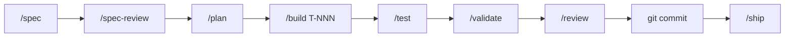

# Spec-Driven Development for Spring Boot 4 + Angular

A tri-platform toolkit (Claude Code · GitHub Copilot · Windsurf) that drives **Spring Framework 7 / Spring Boot 4** and **Angular** full-stack development through a documented, self-validating workflow:

> **specify → review → plan → implement (TDD) → test → validate → review → commit**

The agent validates its own work via a layered harness (build, static analysis, architecture, tests, coverage, mutation, contract, security) instead of relying on a human to inspect every line.



## Why

- **No invention.** During specify/review/plan/tasks, the agent never guesses; every uncertainty becomes a tracked open question that you answer before progress continues.
- **TDD by construction.** Production code can only be written *after* a failing test exists. Hooks enforce it.
- **Traceable.** Every acceptance criterion (`AC-NNN`) maps to tests, code, and the harness gates that exercised it.
- **Self-validating.** A single `.github/scripts/harness.sh` runs locally and in CI; the agent reads its reports and writes a structured validation report.
- **Pre-commit code review** by an agent that uses a Spring-specific rubric.
- **Tri-platform** with a platform-neutral core; thin wrappers for each tool.

## Install

This toolkit is a **set of files you drop into your repo**, not a package you `npm install` or `mvn install`. Pick the path that matches your situation.

### Prerequisites

- **Backend:** Java 25 + Maven 3.9+ (for the Spring harness to run).
- **Frontend:** Node.js 22+ and Angular CLI 20+ (for the Angular harness — lint, typecheck, unit tests, build, e2e).
- At least one supported agent surface installed:
  - [Claude Code](https://docs.claude.com/en/docs/claude-code) (uses `.claude/`)
  - [GitHub Copilot in VS Code](https://code.visualstudio.com/docs/copilot/overview) with chat enabled (uses `.github/`)
  - [Windsurf](https://windsurf.com/) (uses `.windsurf/`)
- `bash`, `git`, `jq` on your `PATH` (the harness scripts use them).

You only need the directories for the agent(s) you actually use; the others can be deleted. For backend-only projects, Angular tooling is not required (and vice versa).

### Option A — Start a new project from this toolkit

```bash
# 1. Clone (or use as a template)
git clone https://github.com/loiane/specs-driven-development-spring-angular.git my-service
cd my-service
rm -rf .git && git init

# 2. Drop in your own Spring Boot 4 application code under src/
#    Merge .github/maven/parent-pom-fragment.xml into your pom.xml
#    (it pins the 10-layer harness: Surefire, Failsafe, JaCoCo, PIT, Checkstyle,
#    SpotBugs, ArchUnit deps, OWASP dep-check, OpenAPI generator).

# 3. Make the scripts and hooks executable
chmod +x .github/scripts/*.sh .claude/hooks/*.sh

# 4. Verify the harness wires up
./.github/scripts/harness.sh --report     # runs the harness and emits a JSON summary
```

### Option B — Add the toolkit to an existing Spring repo

```bash
# From the root of your existing repo:
git clone --depth=1 https://github.com/loiane/specs-driven-development-spring-angular.git /tmp/sdd

# Copy only what you need (skip the agent dirs you won't use):
cp -r /tmp/sdd/docs /tmp/sdd/examples .
cp -r /tmp/sdd/.claude   .   # if you use Claude Code
cp -r /tmp/sdd/.github   .   # if you use Copilot   (merges with existing .github/)
cp -r /tmp/sdd/.windsurf .   # if you use Windsurf

chmod +x .github/scripts/*.sh .claude/hooks/*.sh

# Then merge .github/maven/parent-pom-fragment.xml into your pom.xml.
# Then run the brownfield onboarding command from your agent (see Use below).
```

> **Note on `.github/`** — if you already have `.github/workflows/`, review
> `.github/workflows/ci.yml` before copying so it doesn't clobber yours.
> The shipped `ci.yml` validates **the toolkit itself** (shellcheck, markdown
> lint, broken links, tri-platform parity). In a Spring consumer project you
> should **delete it** and add your own workflow that calls
> `./.github/scripts/harness.sh` to run the 10-layer Spring harness.

### Verify per-platform wiring

| Platform | Smoke test |
| --- | --- |
| Claude Code | Open the repo, run `/help` — you should see the command catalog. |
| Copilot | Open Copilot Chat, type `/spec` — you should see the chat-mode prompt from `.github/chatmodes/`. |
| Windsurf | Open Cascade, type `/spec` — Windsurf loads the workflow from `.windsurf/workflows/`. |

## Use

Once installed, you drive everything from your agent's chat using slash commands. The same commands work on all three platforms.

### Day-zero (brownfield only)

```text
/onboard
```

Classifies the repo, captures a baseline harness run, writes
`.specs/_onboarding.md` and `docs/known-debt.md`, and adds any missing harness
layers as ratchets (so existing failures don't block you, but no new ones can
land). See [examples/brownfield/README.md](examples/brownfield/README.md).

### Per-feature loop

```text
/spec "Add gift-card checkout"      # or: /spec JIRA-123
/spec-review                        # gate exit from Phase 1
/epic-plan                          # for Epics: high-level design + slice roadmap
/plan                               # design + tasks + .tdd-state.json
/build T-001                        # red → green → refactor → simplify (one task at a time)
/test --gap                         # close coverage / mutation gaps
/validate                           # full 10-layer harness + traceability
/review                             # pre-commit code review against the Spring rubric
git commit                          # YOU run this — the agent never commits
/ship                               # post-commit ship plan + release notes (never deploys)
```

Repeat `/build T-NNN` for each task in `04-tasks.md`. The agent refuses to edit
`src/main/**` unless `.specs/<feature-id>/.tdd-state.json` shows a failing test
for the active task.

For Epic-sized initiatives, run `/epic-plan` after `/spec-review`, then run `/plan`
to produce slice-level detailed design and tasks from the approved roadmap.

### Read-only helpers

- `/status` — see where each feature sits in the pipeline.
- `/help [command]` — print the command catalog or a single command spec.

### Natural-language aliases

You don't have to remember the slash names. These phrases are routed to the
right command by [.claude/hooks/route-natural-language-aliases.sh](.claude/hooks/route-natural-language-aliases.sh)
and the equivalent Copilot ([.github/instructions/always-on.instructions.md](.github/instructions/always-on.instructions.md))
and Windsurf ([.windsurf/rules/always-on.md](.windsurf/rules/always-on.md)) instructions:

| You type | Runs |
| --- | --- |
| "spec this" / "turn this ticket into requirements" | `/spec` |
| "review the spec" | `/spec-review` |
| "plan this epic" / "design this epic" / "slice this epic" | `/epic-plan` |
| "plan this" / "design this" | `/plan` |
| "implement T-003" / "build T-003" | `/build T-003` |
| "validate" / "run the harness" | `/validate` |
| "review the code" / "pre-commit review" | `/review` |
| "simplify the code" / "remove the cleverness" | `/code-simplify` |
| "ship it" / "release this" / "prepare release" | `/ship` |
| "onboard this repo" | `/onboard` |

Full list: [.github/prompts/](.github/prompts/) (Copilot), [.claude/commands/](.claude/commands/) (Claude Code), [.windsurf/workflows/](.windsurf/workflows/) (Windsurf).

### Running the harness directly

The same gates the agent runs are reachable from a normal terminal:

```bash
./.github/scripts/harness.sh                 # all 10 layers
./.github/scripts/harness.sh --report        # emit harness-summary.json
./.github/scripts/check-new-code-coverage.sh # diff-coverage gate against main
./.github/scripts/traceability.sh <feature-id>
```

## Loop engineering (optional)

Once you trust the harness, you can wrap the per-feature commands in **bounded agentic loops** that converge on a checkable goal instead of running forever or giving up too early. The toolkit ships the pattern as the `loop-engineering` skill, plus four concrete loops that compose into an issue-to-merged pipeline:

| Loop | Skill | Drives | Cadence |
| --- | --- | --- | --- |
| Spec-sharpen | `spec-sharpen-loop` | issue → a spec that passes `/spec-review` | human-paced |
| Build | `sdd-build-loop` | sharp spec → a clean, `/review`-approved branch | self-paced |
| Ship | `pr-quality-gate` | open PR → all CI gates green | polled on CI |
| Review-response | `pr-review-response` | green PR → every reviewer thread addressed | polled on review |

Human judgment lands at exactly two points — answering genuine product questions at the front, and deciding a branch is worth a PR in the middle. Every loop is bounded, never merges on its own, and escalates when it is stuck.

In Claude Code these run via the native `/loop` command (for example `/loop 10m /pr-quality-gate 1234`). On Copilot and Windsurf you drive the same cadence by re-invoking the skill. See [docs/loop-engineering.md](docs/loop-engineering.md) for the full pattern, the four loop shapes, and the trust you have to earn before running the build loop.

### Running a loop on each tool

The skills are identical across platforms; only the way you *drive the cadence* differs. Claude Code has a native `/loop`; on Copilot and Windsurf the skill runs one pass per prompt and you re-invoke it each cycle (or stop when it reports done).

**Claude Code** — the native `/loop` command supplies the cadence and budget:

```text
/loop /spec-sharpen-loop 42                         # issue #42 → a reviewed spec (human-paced)
/loop /sdd-build-loop 2026-05-09-create-customer    # spec → clean reviewed branch (self-paced)
/loop 10m /pr-quality-gate 1234                      # PR #1234 → all gates green, polling CI
/loop 15m /pr-review-response 1234                   # work reviewer comments to zero
```

**GitHub Copilot** — no native `/loop`; prompt the skill in Copilot Chat and re-run it each cycle:

```text
Run the pr-quality-gate loop on PR 1234: do one pass — check every gate, fix what
is red, commit and push, then stop. I'll re-run this after each CI cycle until it
posts "ready to merge".
```

Copilot loads `.github/skills/pr-quality-gate/SKILL.md`, does a single pass, and stops. Repeat the prompt once per CI run.

**Windsurf** — no native `/loop`; ask Cascade to use the skill, one pass at a time:

```text
Use the pr-quality-gate skill to drive PR 1234 to merge-ready. Do one pass: read
the gates, fix failures, commit, push, then stop. Re-invoke me on the next CI run.
```

Cascade activates `.windsurf/skills/pr-quality-gate/SKILL.md` by model decision. The same pattern works for all four loops — swap in `spec-sharpen-loop`, `sdd-build-loop`, or `pr-review-response` with the matching issue/feature/PR id.

## Repository layout

```text
docs/             methodology · harness-principles · spec-format · platform-mapping · artifact-contract · loop-engineering
.claude/          agents · skills · commands · hooks · templates · checklists · maven · settings.json   (Claude Code)
.github/          chatmodes · prompts · instructions · skills · templates · checklists · maven · scripts · workflows/   (Copilot + CI)
.windsurf/        rules · workflows · skills · templates · checklists · maven   (Windsurf)
examples/         greenfield (worked end-to-end specs) · brownfield (onboarding report)
```

Each platform directory currently carries its own copy of the skills,
templates, checklists, and Maven parent-pom fragment. The CI workflow
(`.github/workflows/ci.yml`) enforces that these copies stay in lockstep via
`diff -rq` parity checks. A future `shared/` directory will become the single
source of truth — see [CONTRIBUTING.md](CONTRIBUTING.md).

## Workflow artifacts

Each feature lives under `.specs/<feature-id>/`:

| File | Phase | Owner |
| --- | --- | --- |
| `01-spec.md` | Specify | `spec-author` |
| `02-spec-review.md` | Review specs | `spec-author` |
| `03-epic-design.md` | Plan (Epic mode) | `spring-architect` / `angular-architect` |
| `03a-epic-roadmap.md` | Plan (Epic mode) | `spring-architect` / `angular-architect` |
| `03-design.md` | Plan | `spring-architect` / `angular-architect` |
| `04-tasks.md` | Plan | `spring-architect` / `angular-architect` |
| `05-implementation-log.md` | Implement (TDD) | `spring-implementer` + `spring-test-engineer` / `angular-implementer` + `angular-test-engineer` |
| `06-test-plan.md` | Test | `spring-test-engineer` / `angular-test-engineer` |
| `07-validation-report.md` | Validate | `spring-validator` / `angular-validator` |
| `07a-traceability.md` | Validate | `spring-validator` / `angular-validator` |
| `08-code-review.md` | Code review | `spring-code-reviewer` / `angular-code-reviewer` |

### Stack routing

Each command defaults to the Spring agent but **automatically delegates to the Angular counterpart** based on feature scope:

- **Backend-only** → Spring agents
- **Frontend-only** → Angular agents
- **Full-stack** → both agents collaborate, splitting tasks by stack

The routing contract is documented in each command's `## Stack routing` section. See [.claude/commands/plan.md](.claude/commands/plan.md) for an example.

## Documentation

- [docs/methodology.md](docs/methodology.md) — the 7-phase workflow in detail
- [docs/harness-principles.md](docs/harness-principles.md) — self-validation philosophy and gate layers
- [docs/spec-format.md](docs/spec-format.md) — EARS-lite spec format with examples
- [docs/platform-mapping.md](docs/platform-mapping.md) — how Claude/Copilot/Windsurf artifacts map
- [docs/artifact-contract.md](docs/artifact-contract.md) — `.specs/<id>/` file layout and `.tdd-state.json` schema
- [docs/loop-engineering.md](docs/loop-engineering.md) — bounded agentic loops and the issue-to-merged pipeline
- [examples/greenfield/README.md](examples/greenfield/README.md) — full worked feature
- [examples/brownfield/README.md](examples/brownfield/README.md) — onboarding-only walkthrough

## Stack assumptions

### Backend (Spring)

- Java 25, Spring Framework 7, Spring Boot 4
- Maven (Gradle support deferred)
- REST APIs with OpenAPI
- Module boundaries enforced via ArchUnit rules (no extra runtime dependency)
- DB engine + migration tool (Flyway/Liquibase) auto-detected from `pom.xml`
- Testcontainers integration tests are mandatory when Testcontainers is detected

### Frontend (Angular)

- Angular 20+ with standalone components
- TypeScript strict mode
- Route-level code splitting
- Accessible components (ARIA, keyboard reachability)
- Unit tests (Karma/Jest) + e2e tests (Cypress/Playwright)
- Typed API clients (no untyped HTTP response handling)

## License

MIT — see [LICENSE](LICENSE).
